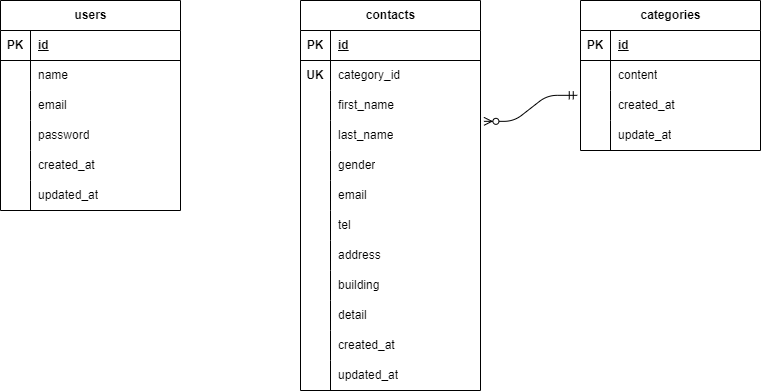

## アプリケーション名
ここにアプリの名前を記載

## 環境構築
```
リポジトリからダウンロード
git clone git@github.com:pao590/tao-kadai.git

srcディレクトリにある「.env.example」をコピーして 「.env」を作成し DBの設定を変更
$ cp .env.example .env
---
DB_HOST=mysql
DB_DATABASE=laravel_db
DB_USERNAME=laravel_user
DB_PASSWORD=laravel_pass
---

dockerコンテナを構築
$ docker-compose up -d --build

Laravelをインストール
$ docker-compose exec php bash
> composer install

アプリケーションキーを作成
> php artisan key:generate

DBのテーブルを作成
> php artisan migrate

DBのテーブルにダミーデータを投入
> php artisan db:seed

"The stream or file could not be opened"エラーが発生した場合
srcディレクトリにあるstorageディレクトリ以下の権限を変更
$ chmod -R 777 storage
```

## ER図

